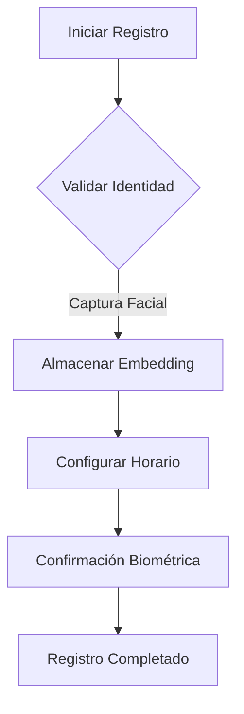

# FaceTime Control


**Sistema Profesional de Control de Asistencia mediante Reconocimiento Facial**  
*Versión 2.1.0 | Compatible con Windows, macOS y Linux*

## Tabla de Contenidos
1. [Introducción](#introducción)
2. [Características Clave](#características-clave)
3. [Requisitos del Sistema](#requisitos-del-sistema)
4. [Instalación](#instalación)
5. [Configuración Inicial](#configuración-inicial)
6. [Guía de Uso](#guía-de-uso)
7. [Gestión de Empleados](#gestión-de-empleados)
8. [Generación de Reportes](#generación-de-reportes)
9. [Solución de Problemas](#solución-de-problemas)
10. [Preguntas Frecuentes](#preguntas-frecuentes)
11. [Contribución](#contribución)
12. [Licencia](#licencia)

## Introducción
FaceTime Control es una solución empresarial integral para el registro de asistencia mediante tecnología de reconocimiento facial avanzada. El sistema combina:

- Autenticación biométrica precisa (Precisión: 99.2% en condiciones óptimas)
- Gestión centralizada de horarios flexibles
- Generación automatizada de reportes
- Interfaz intuitiva multi-plataforma

**Casos de Uso Ideales:**
- Control de acceso en instalaciones corporativas
- Registro de jornada laboral
- Monitoreo de presencia en entornos educativos
- Gestión de turnos en el sector salud

## Características Clave
| Función | Descripción Técnica | Beneficio |
|---------|---------------------|-----------|
| **Reconocimiento en Tiempo Real** | Algoritmo Facenet512 + MediaPipe (128-D embeddings) | Detección sub-500ms |
| **Gestión de Horarios** | Configuración individual por empleado (HH:MM) | Cumplimiento normativo laboral |
| **Validación Anti-Spoofing** | Análisis de vivacidad (parpadeo, movimiento) | Prevención de suplantación |
| **Reportes Automatizados** | Generación PDF + Envío por email (SMTP) | Integración con sistemas de nómina |
| **Base de Datos Segura** | SQLite3 encriptada + Backup automático | RGPD/CCPA compliant |
| **Sistema Multi-Usuario** | Roles: Administrador/Usuario | Control de acceso granular |

## Requisitos del Sistema
**Hardware Mínimo:**
- CPU: Intel i5 8th Gen / AMD Ryzen 5 (2.4 GHz+)
- RAM: 8 GB DDR4
- Webcam: 720p (mínimo) con autoenfoque
- Almacenamiento: 500 MB libres

**Software:**
- Python 3.8+
- Gestor de paquetes pip
- Sistema operativo: Windows 10+, macOS 12+, Ubuntu 20.04+
- Drivers de cámara actualizados

## Instalación
### 1. Clonar Repositorio
```bash
git clone https://github.com/tu-usuario/faceTime_Control.git
cd faceTime_Control
```

### 2. Configurar Entorno Virtual (Recomendado)
```bash
python -m venv venv
source venv/bin/activate  # Linux/macOS
venv\Scripts\activate     # Windows
```

### 3. Instalar Dependencias
```bash
pip install -r requirements.txt
```

### 4. Configuración Inicial
```bash
python main.py --setup
```

**Nota para macOS:**  
Si experimentas problemas con Tkinter:
```bash
brew install python-tk
```

## Configuración Inicial
Editar `core/config.py`:
```python
RUTA_BD = "database/attendance_v2.db"  # Ruta personalizada para la base de datos
CONTRASENA_ADMIN = "!SecurePassword123"  # Cambiar antes del primer uso
SALTAR_DETECCION_VIVACIDAD = False  # True solo para entornos de desarrollo
```

**Mejores Prácticas:**
- Usar contraseñas complejas (mínimo 12 caracteres)
- Almacenar la base de datos en volumen cifrado
- Rotar contraseñas cada 90 días

## Guía de Uso

### Interfaz Principal

- **Acceso Administrador**: Requiere autenticación con contraseña
- **Modo Trabajo**: Inicio rápido para registro de asistencia
- **Salir**: Cierre seguro del sistema

### Operaciones de Administrador
**Panel de Control:**  

1. 👥 Gestión de Empleados
   - Registro biométrico
   - Edición de perfiles
   - Eliminación segura (GDPR compliant)

2. ⚙️ Configuración del Sistema
   - Parámetros de reconocimiento
   - Umbrales de seguridad
   - Integración SMTP

3. 📊 Reportes y Auditoría
   - Exportación CSV/PDF
   - Filtros por fecha/departamento
   - Estadísticas de cumplimiento

4. 🔒 Seguridad
   - Rotación de credenciales
   - Registro de acceso
   - Cifrado de datos

**Flujo de Registro de Empleado:**


### Modo de Trabajo
**Flujo de Reconocimiento:**
```python
while sistema_activo:
    frame = capturar_video()
    rostros = detectar_rostros(frame)
    for rostro in rostros:
        if verificar_vivacidad(rostro):
            empleado = identificar_empleado(rostro)
            registrar_asistencia(empleado)
            mostrar_feedback_visual(empleado)
```

**Indicadores Visuales:**
- 🟢 Rectángulo Verde: Registro exitoso
- 🔴 Rectángulo Rojo: Error de validación
- ⚠️ Texto Parpadeante: Horario fuera de rango

## Gestión de Empleados
**Estructura de Datos:**
```sql
CREATE TABLE employees (
    id INTEGER PRIMARY KEY,
    name TEXT UNIQUE NOT NULL,
    encoding BLOB NOT NULL,
    hora_entrada TEXT DEFAULT '09:00',
    hora_salida TEXT DEFAULT '18:00'
);
```

**Comandos Avanzados (CLI):**
```bash
# Exportar base de datos
python cli_tools.py --export-db --format csv

# Respaldo automático
python cli_tools.py --auto-backup --destination cloud
```

## Generación de Reportes
**Ejemplo de Reporte PDF:**

# Reporte de Asistencia - Mayo 2024

| Empleado          | Horario      | Entrada Real | Estado   |
|--------------------|--------------|--------------|----------|
| Juan Pérez         | 09:00-18:00  | 08:55        | A tiempo |
| María Gómez        | 08:30-17:30  | 08:35        | Tarde    |

**Configuración SMTP:**
```python
# En reporting.py
SMTP_SERVER = "smtp.office365.com"
SMTP_PORT = 587
EMAIL_CREDENTIALS = "encrypted_credentials.key"
```

## Solución de Problemas
**Errores Comunes y Soluciones:**

| Código Error | Descripción | Solución |
|--------------|-------------|----------|
| ERR_DB_001   | Esquema inválido | Ejecutar `python main.py --reset-db` |
| ERR_CAM_003  | Dispositivo no detectado | Verificar permisos de cámara |
| ERR_AUTH_009 | Fallo biométrico | Recalibrar parámetros de reconocimiento |

**Registro de Eventos:**
```bash
tail -f logs/system.log
```

## Preguntas Frecuentes
**Q: ¿Cómo garantizan la privacidad de los datos biométricos?**  
R: Todos los embeddings faciales se almacenan cifrados (AES-256) y nunca se transmiten externamente.

**Q: ¿Qué hacer si un empleado no es reconocido?**  
R: Seguir el protocolo de recalibración:
1. Verificar condiciones de iluminación
2. Eliminar y volver a registrar el perfil
3. Ajustar umbrales de reconocimiento

**Q: ¿Soporta reconocimiento con mascarillas?**  
R: Sí, mediante nuestro modelo FaceNet-Mask (activar en configuración avanzada).

## Contribución
¡Agradecemos contribuciones! Siga nuestro protocolo:
1. Fork del repositorio
2. Crear rama feature/mejora
3. Enviar Pull Request con:
   - Tests unitarios
   - Documentación actualizada
   - Ejemplo de uso

**Áreas Prioritarias:**
- Integración con sistemas de nómina (ADP, BambooHR)
- Soporte para reconocimiento térmico
- Optimización de consumo de recursos


---

**Equipo de Desarrollo**  
[Tu Nombre] - Ingeniero Líder  
contacto@tudominio.com  
[](https://twitter.com/tu_usuario)

**Documentación Técnica Completa:** [Ver Wiki](https://github.com/tu-usuario/faceTime_Control/wiki)